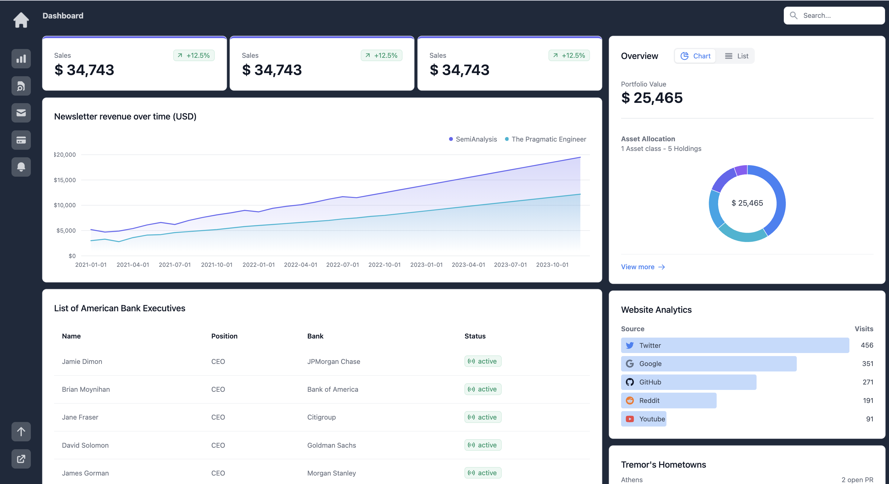
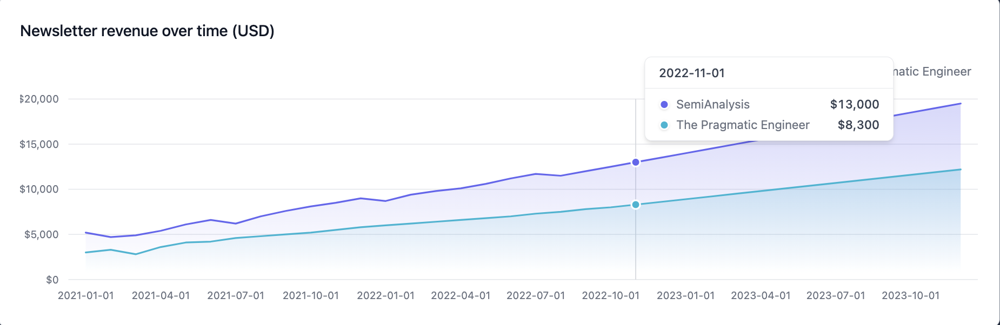
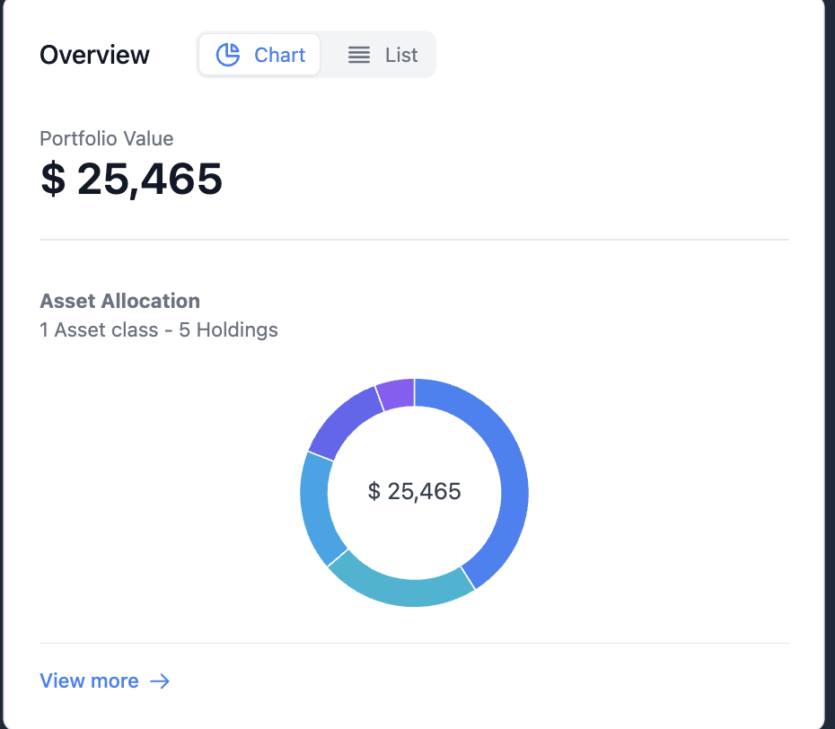
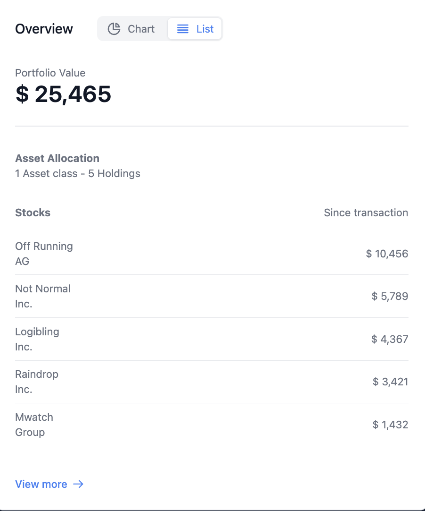

# React Admin Dashboard

This project is a responsive admin dashboard built with React, Vite, Tailwind CSS, and Tremor components. The dashboard provides a clean and modern interface for managing data and visualizing analytics.






## Table of Contents

- [Technologies](#technologies)
- [Getting Started](#getting-started)
  - [Prerequisites](#prerequisites)
  - [Installation](#installation)
- [Usage](#usage)
- [File Structure](#file-structure)
- [Contributing](#contributing)
- [Contact](#contact)
- [License](#license)

## Technologies

### Frontend

- **React**: JavaScript library for building user interfaces.
- **Vite**: Next-generation frontend tooling for fast development.
- **Tailwind CSS**: Utility-first CSS framework for rapid UI development.
- **Tremor Components**: Pre-built components for dashboards and data visualization.

### Others

- **Git**: Version control system for tracking changes in the source code.
- **npm**: Package manager for JavaScript.

### Features

- **Responsive Design**: Optimized for different screen sizes and devices.
- **Interactive UI**: Modern and user-friendly interface for managing data.
- **Real-time Analytics**: Visualize data with dynamic and interactive charts.
- **Pre-built Components**: Utilize Tremor components for quick and easy dashboard setup.

## Getting Started

Follow these instructions to set up the project on your local machine.

### Prerequisites

- [Node.js](https://nodejs.org/) (v14 or higher)
- npm or [yarn](https://yarnpkg.com/)

### Installation

1. **Clone the repository:**
   ```sh
   git clone https://github.com/RamonvCS/react-dash.git
Navigate to the project directory:
sh
Copy code
cd react-dash
Install dependencies:
sh
Copy code
npm install
Start the development server:
sh
Copy code
npm run dev
Usage
After starting the development server, open your web browser and navigate to http://localhost:3000 to view the dashboard. Explore the various sections to manage and visualize your data.

File Structure
plaintext
Copy code
react-dash
├── public
├── src
│   ├── assets
│   │   └── Images
│   ├── components
│   ├── hooks
│   ├── layouts
│   ├── pages
│   ├── styles
│   ├── utils
│   ├── App.jsx
│   └── main.jsx
├── .gitignore
├── package-lock.json
├── package.json
├── tailwind.config.js
└── vite.config.js
Contributing
Contributions are welcome! If you have suggestions for improving the dashboard, please follow these steps:

Fork the repository.
Create a new branch (git checkout -b feature-branch).
Make your changes.
Commit your changes (git commit -m 'Add new feature').
Push to the branch (git push origin feature-branch).
Open a pull request.
Contact
For any inquiries, please contact Ramon Valentin-Rivera.
